# 📂 Honey-Scan: Prozess-Mapping auf Skript-Ebene

Diese Diagramme zeigen nicht nur was passiert, sondern **wo** (in welcher Datei) es passiert. Das hilft Entwicklern, sich im Code zurechtzufinden.

## 1. High-Level Architektur & Dateizugehörigkeit
Dieses Diagramm ordnet die Hauptphasen den spezifischen Python-Dateien zu.

```mermaid
graph TD
    %% Definition der Styles für Dateien
    classDef mainFile fill:#e84393,stroke:#fff,color:#fff,stroke-width:2px;
    classDef logicFile fill:#0984e3,stroke:#fff,color:#fff;
    classDef dataFile fill:#fdcb6e,stroke:#333,color:#000;
    classDef outFile fill:#00b894,stroke:#fff,color:#fff;

    User((👤 User)) -->|Start CLI| MainScript[📄 main.py<br>Entry Point & ArgParse]:::mainFile

    subgraph "Initialization & Control"
        MainScript -->|Init Config| Controller[📄 controller.py / core.py<br>Job Dispatcher & Threading]:::logicFile
        Controller -->|Lade Patterns| Signatures[📄 signatures.py / .json<br>Pattern Datenbank]:::dataFile
    end

    subgraph "Active Scanning (Worker Threads)"
        Controller -->|Spawn Thread| Scanner[📄 scanner.py<br>Socket Handling & Logic]:::logicFile
        Scanner <-->|Network Traffic| Target((🌐 Target IP))
        
        Scanner -.->|Import/Lookup| Signatures
    end

    subgraph "Output & Reporting"
        Scanner -->|Return Result| Aggregator[📄 output.py / logger.py<br>Result Aggregation]:::outFile
        Aggregator -->|Write| JSONLog[📄 results.json<br>Log File]:::outFile
        Aggregator -->|Print| Console[🖥️ StdOut]:::outFile
    end
```

---

## 2. Der Core-Scan-Loop (Interner Ablauf in scanner.py)
Hier sehen wir den genauen Ablauf innerhalb des Scanner-Moduls und wie es externe Ressourcen (Signatures) nutzt.

```mermaid
flowchart TD
    %% Styles
    style ScannerScope fill:#2d3436,stroke:#74b9ff,stroke-width:2px,color:#fff
    style SigScope fill:#2d3436,stroke:#ffeaa7,stroke-width:2px,color:#fff
    
    Start([Start Task]) --> ScannerFn

    subgraph ScannerScope [📄 scanner.py]
        ScannerFn[func: scan_target] --> SockCreate[socket.socket]
        SockCreate --> Connect{connect_ex}
        
        Connect -- Error/Closed --> ReturnFalse([Return: None])
        Connect -- Success --> Payload[func: send_payload<br>Sende 'Fake' Header]
        
        Payload --> Recv[socket.recv]
        Recv --> CheckEmpty{Daten leer?}
        
        CheckEmpty -- Ja --> ReturnFalse
        CheckEmpty -- Nein --> Decode[func: normalize_data]
    end

    Decode --> MatchCall

    subgraph SigScope [📄 signatures.py]
        MatchCall[func: check_signatures] --> Iterate{Iteriere Regex}
        Iterate -- Match Found --> GetType[Honeypot Type: 'Cowrie']
        Iterate -- No Match --> ReturnNull
    end

    GetType --> ResultBuild[Erstelle Result Objekt]
    ReturnNull --> Heuristic[⚠️ Fallback: Heuristik Check]
    
    Heuristic -- Score > 0.8 --> ResultBuild
    Heuristic -- Score < 0.8 --> ReturnFalse
    
    ResultBuild --> End([Return: Result])
```

---

## 3. Sequenzdiagramm: Interaktion der Skripte
Der zeitliche Ablauf eines Aufrufs, der zeigt, wann welches Skript die Kontrolle übernimmt.

```mermaid
sequenceDiagram
    autonumber
    participant User
    participant Main as 📄 main.py
    participant Ctrl as 📄 controller.py
    participant Scan as 📄 scanner.py
    participant Sigs as 📄 signatures.py
    participant Net as 🌐 Network/Target

    Note over User, Main: Phase 1: Setup
    User->>Main: python3 honey-scan.py -t 10.0.0.1
    Main->>Main: parse_args()
    Main->>Ctrl: initialize_scan(target, config)
    
    Note over Ctrl, Sigs: Phase 2: Execution
    Ctrl->>Sigs: load_patterns()
    Sigs-->>Ctrl: return patterns_dict
    
    Ctrl->>Ctrl: create_thread_pool()
    Ctrl->>Scan: run_scan(ip, port, patterns)
    activate Scan
    
    Scan->>Net: SYN / Connect
    Net-->>Scan: SYN-ACK / Accept
    
    Scan->>Net: send(PAYLOAD_BYTES)
    Net-->>Scan: recv(BANNER_DATA)
    
    Scan->>Scan: normalize(BANNER_DATA)
    
    Note right of Scan: Validierung gegen signatures.py
    loop Pattern Matching
        Scan->>Sigs: match(data, pattern_id)
        Sigs-->>Scan: True/False
    end
    
    Scan-->>Ctrl: return ScanResultObject
    deactivate Scan
    
    Note over Ctrl, User: Phase 3: Reporting
    Ctrl->>Ctrl: process_results()
    Ctrl->>User: print(formatted_output)
```

