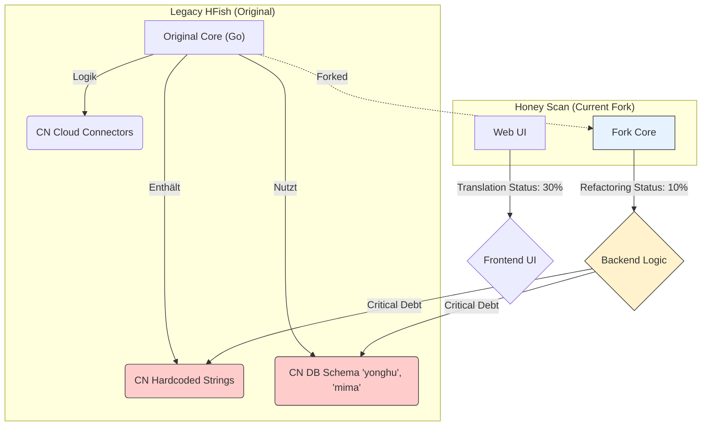
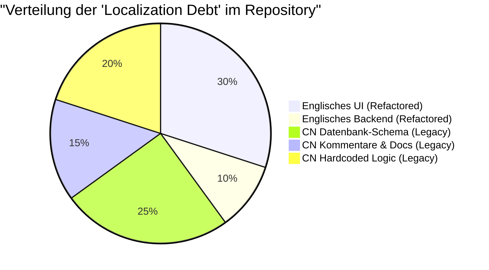

# Honey Scan: Technischer Analysebericht & Architektur-Roadmap

**Status:** Draft / Deep Research  
**Datum:** 13.01.2026  
**Autor:** Senior Lead Architect  
**Repository:** `derlemue/honey-scan` (Fork von `hacklcx/HFish`)

---

## 1. Executive Summary

Dieser Bericht analysiert den aktuellen Zustand des honey-scan Repositories, bewertet die technische Machbarkeit eines Wechsels zu PHP und definiert die zukünftige hybride Architektur. Die Analyse bestätigt, dass eine vollständige Portierung des Backends auf PHP abgelehnt (**VETO**) wird, da dies die Performance bei High-Concurrency-Angriffen gefährdet. Stattdessen wird eine hybride Strategie (Go Core + Web UI) verfolgt.

---

## 2. Ist-Zustand: Codebase & "Localization Debt"

Das Repository ist ein Fork von HFish, einer chinesischen Honeypot-Plattform. Die größte technische Schuld (Technical Debt) liegt in der tiefen Verwurzelung der chinesischen Sprache in Datenbank-Schemata, Kommentaren und hartcodierter Logik.

### 2.1 Visuelle Code-Analyse (Diff)

Das folgende Diagramm zeigt die Diskrepanz zwischen dem Original und dem aktuellen Fork sowie die Verteilung der Altlasten.



### 2.2 Verteilung der Komponenten

Diese Übersicht zeigt, wo sich die sprachlichen und logischen Barrieren befinden.



---

## 3. Das Performance-Dilemma: Go vs. PHP

Ein Kernpunkt der Anforderung war die Evaluierung eines Wechsels zu PHP für das Backend.

### 3.1 Architektur-Entscheidung: VETO für PHP im Core

Die folgende Sequenzanalyse verdeutlicht, warum PHP für einen High-Interaction Honeypot ungeeignet ist (Blocking I/O vs. Non-Blocking I/O).

**Szenario:** 10.000 gleichzeitige SYN-Requests (Angriffswelle)

```mermaid
sequenceDiagram
    participant Attacker as Angreifer (Botnet)
    participant Go as Go Routine (Honeypot)
    participant PHP as PHP Worker (Alternative)
    participant Sys as System Resources

    Note over Attacker, Go: Vergleich der Lastbewältigung

    rect rgb(200, 255, 200)
    Note right of Go: Go Architektur (Non-Blocking)
    Attacker->>Go: Sendet 10k Pakete
    Go->>Go: Spawn 10k Goroutines (Micro-Threads)
    Go->>Sys: Verbraucht ~50MB RAM
    Go-->>Attacker: Akzeptiert Verbindungen (Keep-Alive)
    end

    rect rgb(255, 200, 20)
