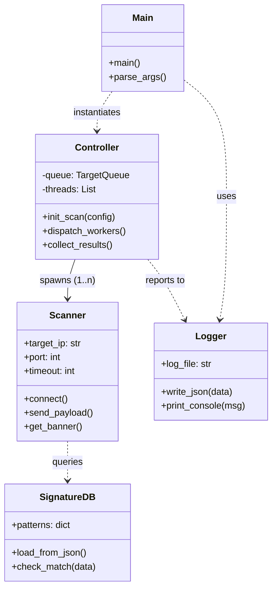
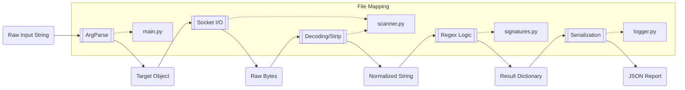
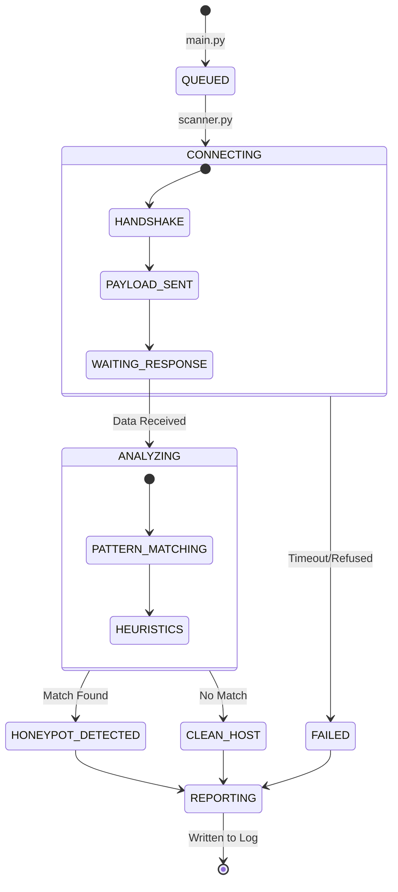

# 🛸 Honey-Scan Architecture Map for Antigravity IDE

Diese Übersicht visualisiert die statische Struktur und die dynamischen Prozesse des Projekts, um die Navigation und das Verständnis innerhalb der IDE zu erleichtern.

## 1. Modul-Abhängigkeits-Graph (Static Structure)
Dieses Klassendiagramm zeigt die Beziehungen zwischen den Python-Modulen. Es hilft der IDE, Import-Pfade und Zuständigkeiten zu verstehen.

---

## 2. Prozess-Ablauf: Runtime Logic
Dieser Flowchart visualisiert den Algorithmus von der Ingest-Phase bis zur Egress-Phase. Er zeigt, wo Entscheidungen getroffen werden (Branches).

```mermaid
graph TD
    %% Nodes
    Start([🚀 Entry Point: main.py])
    
    subgraph "Phase 1: Configuration"
        Init[Parse CLI Args]
        LoadDB[Load signatures.json]
        TargetGen[Generate Target List]
    end
    
    subgraph "Phase 2: The Loop (controller.py)"
        CheckQueue{Queue Empty?}
        SpawnWorker[Spawn Thread / Async Task]
        JoinThreads[Wait for Completion]
    end
    
    subgraph "Phase 3: Deep Scan (scanner.py)"
        Connect[Socket Connect]
        Send[Send Honeypot Payload]
        Recv[Receive Banner/Response]
        
        Analyze{Match Signature?}
        Analyze -- Yes --> ScoreHigh[Set Honeyscore: 1.0]
        Analyze -- No --> Heuristic{Heuristic Check?}
        
        Heuristic -- Suspicious --> ScoreMed[Set Honeyscore: 0.6]
        Heuristic -- Clean --> ScoreLow[Set Honeyscore: 0.0]
    end
    
    subgraph "Phase 4: Output (logger.py)"
        Format[Format Result Dict]
        Save[Write to JSON/Console]
    end

    %% Edges
    Start --> Init
    Init --> LoadDB
    LoadDB --> TargetGen
    TargetGen --> CheckQueue
    
    CheckQueue -- No --> SpawnWorker
    SpawnWorker --> Connect
    
    Connect -->|Error| ScoreLow
    Connect -->|Success| Send
    Send --> Recv
    Recv --> Analyze
    
    ScoreHigh --> Format
    ScoreMed --> Format
    ScoreLow --> Format
    
    Format --> CheckQueue
    CheckQueue -- Yes --> JoinThreads
    JoinThreads --> Save
    Save --> End([🏁 Exit])
```

---

## 3. Data Flow & Transformation (ETL)
Für die IDE ist es wichtig zu wissen, wie sich die Datenstrukturen verändern. Dieses Diagramm zeigt die Metamorphose vom Raw-Input zum Report.

---

## 4. Zustandsautomat (State Machine) für ein Scan-Target
Der Lebenszyklus eines einzelnen Ziels (Host) innerhalb der Applikation.

